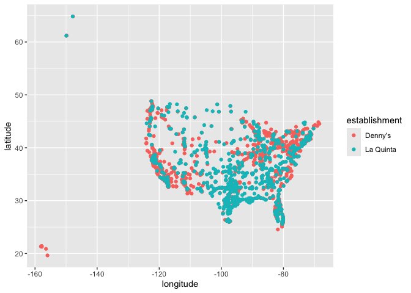
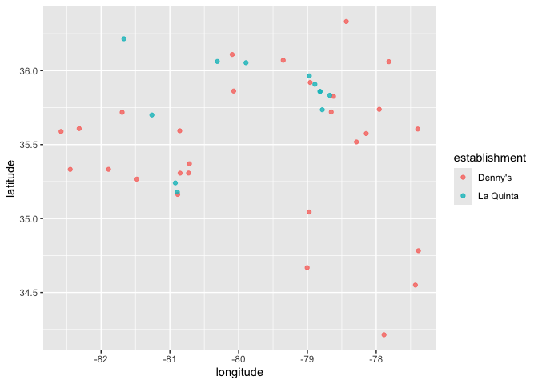
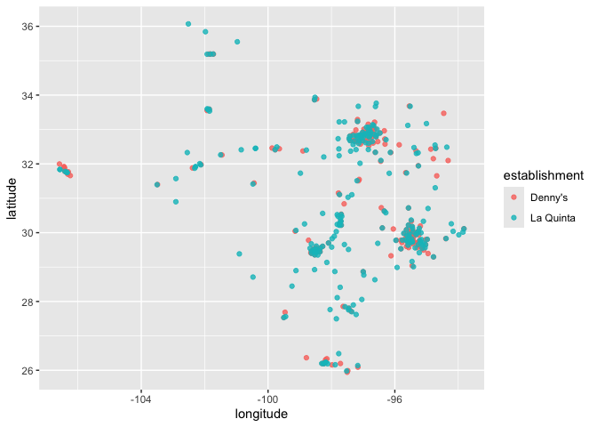

Lab 04 - Visualizing spatial data
================
Enhui Wang
2025.01.26

### Load packages and data

``` r
library(tidyverse) 
library(dsbox) 
```

``` r
states <- read_csv("data/states.csv")
```

### Exercise 1

The dataset has 1643 rows, representing one restaurant. It has 6
variables.

``` r
#rows
nrow(dennys)
```

    ## [1] 1643

``` r
#variables
ncol(dennys)
```

    ## [1] 6

### Exercise 2

The dataset has 909 rows, representing one motel. It has 6 variables.

``` r
#rows
nrow(laquinta)
```

    ## [1] 909

``` r
#variables
ncol(laquinta)
```

    ## [1] 6

### Exercise 3

La Quinta has some locations outside the US, including countries such as
New Zealand, Turkey, the United Arab Emirates, Chile, Colombia, and
Ecuador. Denny’s does not have any locations outside of the US. …

### Exercise 4

I can filter for states where states do not include states in the US.

### Exercise 5

There are not any Denny’s locations outside the US.

``` r
#filter for 'state' that are not in states_abbreviation
dennys %>%
  filter(!(state %in% states$abbreviation))
```

    ## # A tibble: 0 × 6
    ## # ℹ 6 variables: address <chr>, city <chr>, state <chr>, zip <chr>,
    ## #   longitude <dbl>, latitude <dbl>

### Exercise 6

``` r
#add a "United States" variable to the dataset
dn <- dennys %>%
  mutate(country = "United States")
```

### Exercise 7

``` r
#filter for 'state' that are not in states_abbreviation
laquinta %>%
  filter(!(state %in% states$abbreviation))
```

    ## # A tibble: 14 × 6
    ##    address                                  city  state zip   longitude latitude
    ##    <chr>                                    <chr> <chr> <chr>     <dbl>    <dbl>
    ##  1 Carretera Panamericana Sur KM 12         "\nA… AG    20345    -102.     21.8 
    ##  2 Av. Tulum Mza. 14 S.M. 4 Lote 2          "\nC… QR    77500     -86.8    21.2 
    ##  3 Ejercito Nacional 8211                   "Col… CH    32528    -106.     31.7 
    ##  4 Blvd. Aeropuerto 4001                    "Par… NL    66600    -100.     25.8 
    ##  5 Carrera 38 # 26-13 Avenida las Palmas c… "\nM… ANT   0500…     -75.6     6.22
    ##  6 AV. PINO SUAREZ No. 1001                 "Col… NL    64000    -100.     25.7 
    ##  7 Av. Fidel Velazquez #3000 Col. Central   "\nM… NL    64190    -100.     25.7 
    ##  8 63 King Street East                      "\nO… ON    L1H1…     -78.9    43.9 
    ##  9 Calle Las Torres-1 Colonia Reforma       "\nP… VE    93210     -97.4    20.6 
    ## 10 Blvd. Audi N. 3 Ciudad Modelo            "\nS… PU    75010     -97.8    19.2 
    ## 11 Ave. Zeta del Cochero No 407             "Col… PU    72810     -98.2    19.0 
    ## 12 Av. Benito Juarez 1230 B (Carretera 57)… "\nS… SL    78399    -101.     22.1 
    ## 13 Blvd. Fuerza Armadas                     "con… FM    11101     -87.2    14.1 
    ## 14 8640 Alexandra Rd                        "\nR… BC    V6X1…    -123.     49.2

\###Exercise8

``` r
#add a "country" variable to the dataset
lp <- laquinta %>%
  mutate(country = case_when(
    state %in% state.abb ~ "United States",
    state %in% c("ON", "BC") ~ "Canada",
    state == "ANT" ~ "Colombia",
    address == "Carretera Panamericana Sur KM 12" ~ "Mexico",
    address == "Av. Tulum Mza. 14 S.M. 4 Lote 2" ~ "Mexico",
    address == "Ejercito Nacional 8211" ~ "Mexico",
    address == "Blvd. Aeropuerto 4001" ~ "Mexico",
    address == "Carrera 38 # 26-13 Avenida las Palmas con Loma de San Julian El Poblado" ~ "Colombia",
    address == "AV. PINO SUAREZ No. 1001" ~ "Mexico",
    address == "Av. Fidel Velazquez #3000 Col. Central" ~ "Mexico",
    address == "63 King Street East" ~ "Canada",
    address == "Calle Las Torres-1 Colonia Reforma" ~ "Mexico",
    address == "Blvd. Audi N. 3 Ciudad Modelo" ~ "Mexico",
     address == "Ave. Zeta del Cochero No 407" ~ "Mexico",
    address == "Av. Benito Juarez 1230 B (Carretera 57) Col. Valle Dorado Zona Hotelera" ~ "Mexico",
    address == "Blvd. Fuerza Armadas" ~ "Honduras", 
    address == "8640 Alexandra Rd" ~ "Canada",     
    TRUE ~ "Unknown"                               
  )) 

lp <- lp %>%
  filter(country == "United States")
```

\###Exercise 9 CA has the most Denny’s locations, and DE has the fewest.
TX has the most, and AG/ANT/BC/CH/FM/ME/ON/QR/SL/VEANT has the most.
Honestly, it does not surprise me because I have little background
information about these restaurants.

``` r
#summarize the number of Denny's location 
dennys_summary <- dennys %>%
  group_by(state) %>%
  summarise(count = n()) %>%
  arrange(desc(count))

print (dennys_summary)
```

    ## # A tibble: 51 × 2
    ##    state count
    ##    <chr> <int>
    ##  1 CA      403
    ##  2 TX      200
    ##  3 FL      140
    ##  4 AZ       83
    ##  5 IL       56
    ##  6 NY       56
    ##  7 WA       49
    ##  8 OH       44
    ##  9 MO       42
    ## 10 PA       40
    ## # ℹ 41 more rows

``` r
#summarize the number of La Quinta's location 
laquinta_summary <- laquinta %>%
  group_by(state) %>%
  summarise(count = n()) %>%
  arrange(desc(count))

print (laquinta_summary)
```

    ## # A tibble: 59 × 2
    ##    state count
    ##    <chr> <int>
    ##  1 TX      237
    ##  2 FL       74
    ##  3 CA       56
    ##  4 GA       41
    ##  5 TN       30
    ##  6 OK       29
    ##  7 LA       28
    ##  8 CO       27
    ##  9 NM       19
    ## 10 NY       19
    ## # ℹ 49 more rows

``` r
#calculate which states have the most Denny’s locations per thousand square miles.
dn %>%
  count(state) %>%
  inner_join(states, by = c("state" = "abbreviation"))
```

    ## # A tibble: 51 × 4
    ##    state     n name                     area
    ##    <chr> <int> <chr>                   <dbl>
    ##  1 AK        3 Alaska               665384. 
    ##  2 AL        7 Alabama               52420. 
    ##  3 AR        9 Arkansas              53179. 
    ##  4 AZ       83 Arizona              113990. 
    ##  5 CA      403 California           163695. 
    ##  6 CO       29 Colorado             104094. 
    ##  7 CT       12 Connecticut            5543. 
    ##  8 DC        2 District of Columbia     68.3
    ##  9 DE        1 Delaware               2489. 
    ## 10 FL      140 Florida               65758. 
    ## # ℹ 41 more rows

``` r
#calculate which states have the most La Quinta’s locations per thousand square miles.
lp %>%
  count(state) %>%
  inner_join(states, by = c("state" = "abbreviation"))
```

    ## # A tibble: 48 × 4
    ##    state     n name           area
    ##    <chr> <int> <chr>         <dbl>
    ##  1 AK        2 Alaska      665384.
    ##  2 AL       16 Alabama      52420.
    ##  3 AR       13 Arkansas     53179.
    ##  4 AZ       18 Arizona     113990.
    ##  5 CA       56 California  163695.
    ##  6 CO       27 Colorado    104094.
    ##  7 CT        6 Connecticut   5543.
    ##  8 FL       74 Florida      65758.
    ##  9 GA       41 Georgia      59425.
    ## 10 IA        4 Iowa         56273.
    ## # ℹ 38 more rows

\###Exercise 10 Alaska has the most Denny’s and La Quinta’s locations
per thousand square miles

``` r
#put two datasets together into a single data frame.
dn <- dn %>%
  mutate(establishment = "Denny's")
lp <- lp %>%
  mutate(establishment = "La Quinta")
#bind them with the same columns
dn_lp <- bind_rows(dn, lp)
#plot locations of the two establishments using a scatter plot.
ggplot(dn_lp, mapping = aes(
  x = longitude,
  y = latitude,
  color = establishment
)) +
  geom_point()
```

<!-- --> \###Exercise
11 I think the joke partially holds. Because not all points overlap with
each other, and most points are distributed sparsely.

``` r
#filter the data for observations in North Carolina only
NC<- dn_lp %>%
  filter(state == "NC")
#recreate the plot
ggplot(NC, mapping = aes(
  x = longitude,
  y = latitude,
  color = establishment,
)) +
  geom_point(alpha=0.8)
```

<!-- --> \###Exercise
12 I think the joke holds. Because almost all points overlap with each
other in similar areas for Denny’s and La Quinta.

``` r
#filter the data for observations in Texas only
TX<- dn_lp %>%
  filter(state == "TX")
#recreate the plot
ggplot(TX, mapping = aes(
  x = longitude,
  y = latitude,
  color = establishment,
)) +
  geom_point(alpha=0.8)
```

<!-- -->
